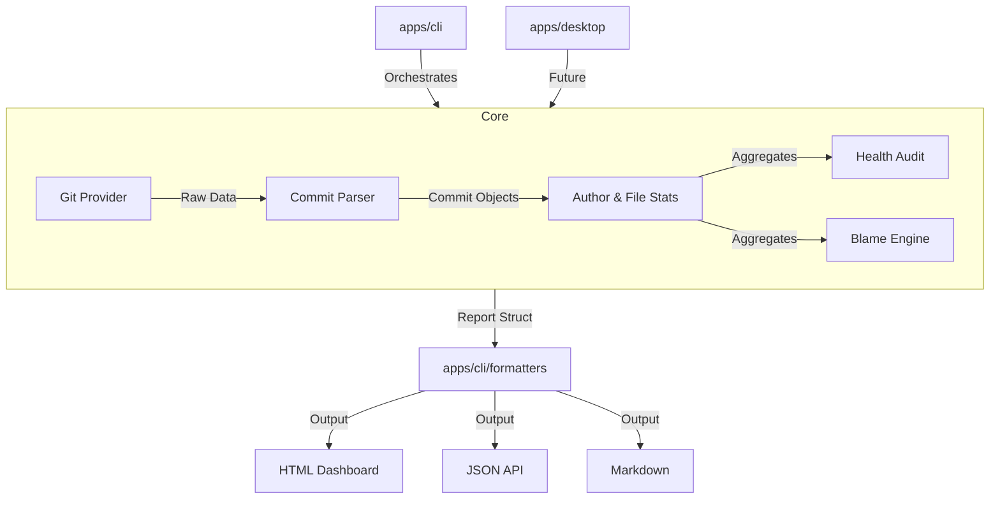

# Architecture

`gitinspector-rs` is designed with a modular, data-first architecture. The system is split into multiple crates to ensure that the core analysis engine can be reused across CLI, Desktop, and Web environments.

## System Design

## Component Breakdown

### 1. `gitinspector-core`
The heartbeat of the project. It handles:
- **Abstraction**: A `GitProvider` trait that allows the engine to run against the CLI `git` command or directly against `libgit2` (planned).
- **Filtering**: A robust `Filter` engine that supports regex-based exclusions for authors, files, and messages.
- **Analysis**: Specialized modules for `timeline` generation, `blame` tracking, and `metrics` (complexity/size) calculation.

### 2. `apps/cli`
The primary interface for v1.1.0. It provides:
- **CLI Parsing**: Powered by `clap` for a modern, type-safe interface.
- **Formatting Layer**: Converts internal analysis structures into user-facing reports (HTML, Markdown, etc.).
- **Progress Tracking**: Uses `indicatif` for real-time console feedback during long-running audits.

### 3. Data Flow
Analysis follows a strictly serializable data flow. Every metric generated by the `core` library implements `serde::Serialize`, ensuring that reports are consistent across all formats (JSON, XML, HTML).

## Future Platform Support
By keeping the `core` decoupled from the UI, we are paving the way for:
- **Tauri-based Desktop App**: A native GUI for exploring repository analytics.
- **WASM Integration**: Running git audits directly in the browser for web-based project management tools.
