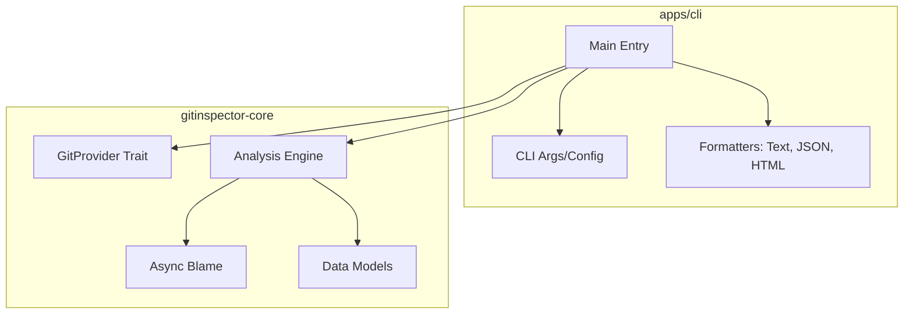
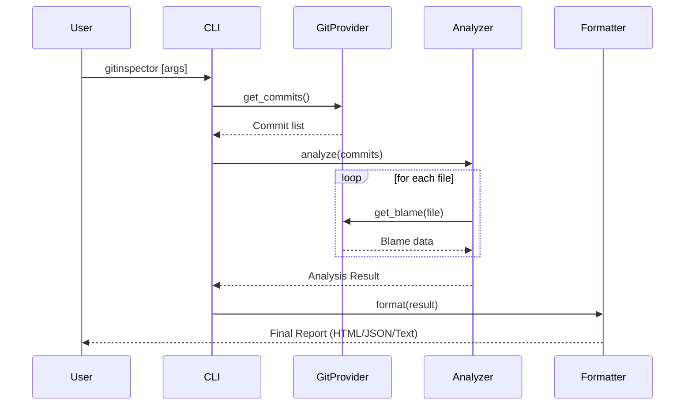

# Diagrams

(arch-block-diagram)=

```mermaid
graph TB
    subgraph CLI [apps/cli]
        Main[Main Entry]
        Config[CLI Args/Config]
        Output[Formatters: Text, JSON, HTML]
    end

    subgraph Core [gitinspector-core]
        Provider[GitProvider Trait]
        Analysis[Analysis Engine]
        Blame[Async Blame]
        Models[Data Models]
    end

    Main --> Config
    Main --> Provider
    Main --> Analysis
    Analysis --> Blame
    Analysis --> Models
    Main --> Output
```

(analysis-sequence)=

```mermaid
sequenceDiagram
    participant U as User
    participant C as CLI
    participant G as GitProvider
    participant A as Analyzer
    participant F as Formatter

    U->>C: gitinspector [args]
    C->>G: get_commits()
    G-->>C: Commit list
    C->>A: analyze(commits)
    loop for each file
        A->>G: get_blame(file)
        G-->>A: Blame data
    end
    A-->>C: Analysis Result
    C->>F: format(result)
    F-->>U: Final Report (HTML/JSON/Text)
```
