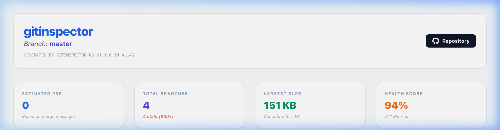

# Gitinspector-rs

**A high-performance git repository analytics engine written in Rust.**

`gitinspector-rs` is a professional-grade diagnostic tool designed to provide deep insights into repository health, contributor activity, and code maintenance hotspots. By leveraging Rust's performance and safety, it delivers lightning-fast analysis even for massive codebases.

## Key Features

### 🏥 Repository Health Diagnostics
Automatically audit your repository for maintenance debt.
- **Stale Branch Detection**: Identify branches inactive for over 90 days.
- **PR Heuristics**: Estimated Pull Request counts based on merge history.
- **Large Blob Audit**: Identify files that might need Git LFS.

### 🎯 Hotspot Analysis
Pinpoint the most active and complex files in your project.
- **Complexity Metrics**: Track physical Line of Code (LOC) and file size (KB).
- **Churn Tracking**: See which files change the most over time.
- **Audit Integration**: Direct links to remote repository files for immediate review.

### 🚚 Code Ownership (Blame)
Understand author responsibility across the entire codebase.
- **Concurrent Analysis**: Multi-threaded git blame execution.
- **Author Stats**: Detailed metrics on insertions, deletions, and total responsibility.
- **Timeline Visualization**: Track activity trends over weeks and months.

## Getting Started

Check out the [Usage](./usage.md) guide to start analyzing your first repository.
