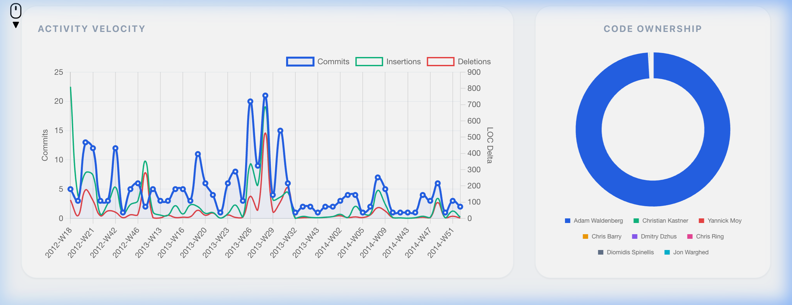
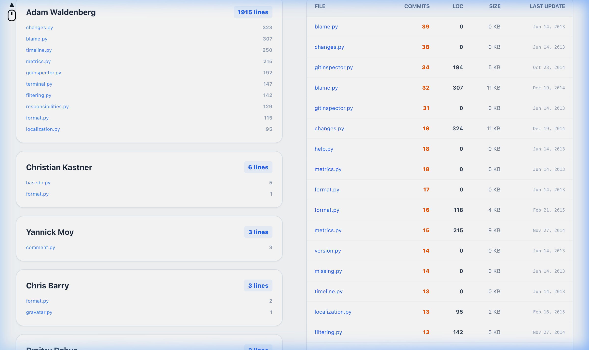
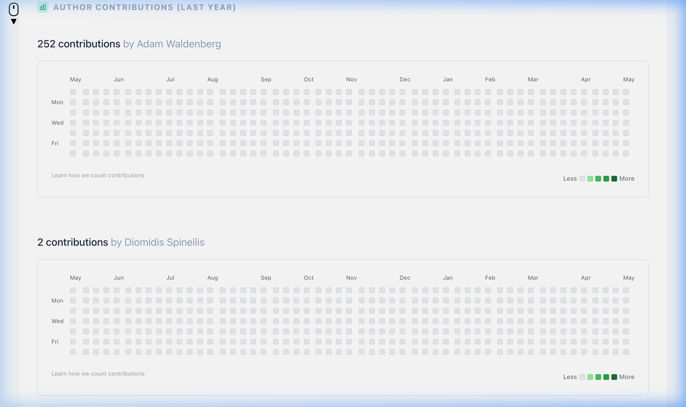

+++ { "kind": "split-image" }

Git Repository Analytics

# GitInspector-rs: Deep Insights, Fast.

A professional-grade diagnostic tool designed to provide deep insights into repository health, contributor activity, and code maintenance hotspots. Built with Rust for ultimate performance.

```{image} ./images/logo.png
:class: only-dark
```
```{image} ./images/logo.png
:class: only-light
```

{button}`Explore Usage Guide </usage>`

+++

## 🚀 Professional Git Analytics

`gitinspector-rs` is designed for teams that need to understand their codebase's evolution without the overhead of heavy enterprise tools. It leverages Rust's concurrent processing to deliver reports in seconds, even for repositories with decades of history.

### 🏥 Repository Health Diagnostics
Automatically audit your repository for maintenance debt.
- **Stale Branch Detection**: Identify branches inactive for over 90 days.
- **PR Heuristics**: Estimated Pull Request counts based on merge history.
- **Large Blob Audit**: Identify files that might need Git LFS.



### 🎯 Hotspot Analysis
Pinpoint the most active and complex files in your project.
- **Complexity Metrics**: Track physical Line of Code (LOC) and file size (KB).
- **Churn Tracking**: See which files change the most over time.
- **Audit Integration**: Direct links to remote repository files for immediate review.



### 🚚 Code Ownership (Blame)
Understand author responsibility across the entire codebase.
- **Concurrent Analysis**: Multi-threaded git blame execution.
- **Author Stats**: Detailed metrics on insertions, deletions, and total responsibility.
- **Timeline Visualization**: Track activity trends over weeks and months.


